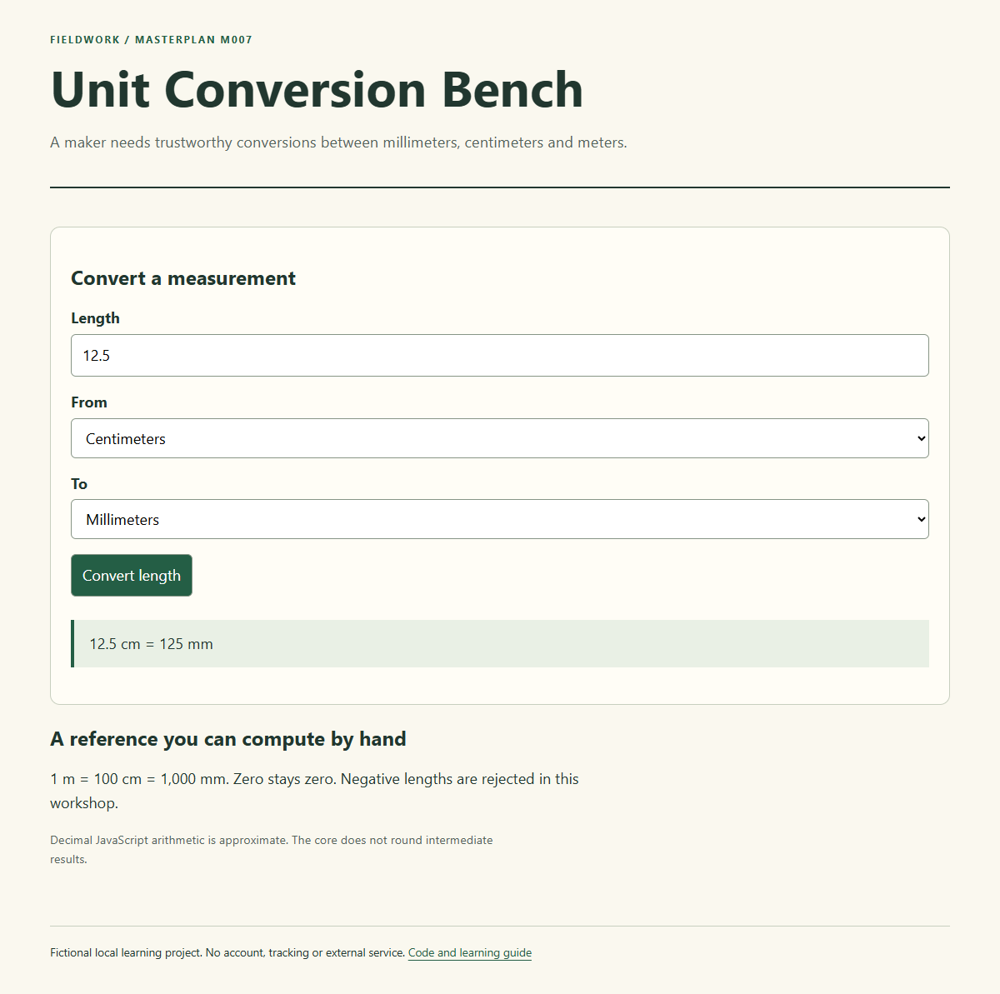

# M007 — Unit Conversion Bench

A maker needs trustworthy conversions between millimeters, centimeters and meters.

This is a complete small **reference implementation and learning workshop** for the first ten MASTERPLAN builds. Study the choices, then make your own variation. The reference is finished; the exercises and your journal are deliberately unfinished.

**Main skill:** Functions and explicit input contracts. **Study pairing:** existing curriculum #7, [jstut](https://github.com/elirc/jstut). [Previous](https://github.com/elirc/masterplan-006-packing-rule-cards) · [Next](https://github.com/elirc/masterplan-008-lost-property-finder)

## Run it

Use Git and Node.js 22 or newer. There are **no package dependencies to install**.

```sh
git clone https://github.com/elirc/masterplan-007-unit-conversion-bench.git
cd masterplan-007-unit-conversion-bench
npm test
npm start
```

Open http://127.0.0.1:4300 and leave the terminal running. Stop with Ctrl+C. Run one project at a time, or use a different PORT for a second server. On PowerShell: `$env:PORT=4301` before `npm start`. The preview serves only public/ on your own computer.

`private: true` in package.json prevents accidental npm publication; it does not make this GitHub repository private. The GitHub repository is intended to be public.

## What the reference promises

Supported units are mm, cm and m. Values must be finite numbers and nonnegative. Zero is valid. Conversion uses a unit ratio, rejects nonfinite output and leaves display rounding out of the core.

A small independent utility requires checking arithmetic rather than consuming another tutorial sequence.

## Read in this order

1. [Learning route](docs/00-START-HERE.md): a manageable session plan and readiness check.
2. [Build walkthrough](docs/01-BUILD-WALKTHROUGH.md): build from requirements to the smallest verified result.
3. [Concepts and execution traces](docs/02-CONCEPTS-AND-TRACES.md): predict, trace and explain the real code.
4. [Code tour and architecture choices](docs/03-CODE-TOUR.md): exact files and responsibilities.
5. [Debugging laboratory](docs/04-DEBUGGING-LAB.md): one worked diagnosis and two guided investigations.
6. [Six learner stories](docs/05-PRACTICE-STORIES.md): features and fixes with plans, acceptance criteria and decisions left to you.
7. [Hints and answer directions](docs/06-HINTS-AND-ANSWERS.md): consult after an attempt.
8. [Agentic coaching prompts](docs/07-AGENTIC-COACHING.md): ask for help without outsourcing the learning.
9. [Build journal and decision narrative](docs/08-BUILD-JOURNAL.md): a retrospective explanation grounded in the actual implementation.
10. [Verification](docs/VERIFICATION.md) and [blank journal](docs/JOURNAL-TEMPLATE.md).



## Know what the checks prove

npm test runs the pure JavaScript boundary regressions. Browser evidence separately covers form interaction, error recovery, layout and keyboard entry.

This is a local educational example with fictional content. There is no production deployment, external data integration, tracking, authentication or payment flow. Do not mistake the deliberately small scope for a template that already solves those additional concerns.

## Your first independent task

Add a display precision option: Allow the UI to choose displayed decimal places while retaining the raw conversion result. Read its acceptance criteria, create a practice branch, and write your prediction before changing code. Keep your personal notes in `my-journal/`, which is ignored by Git.

<!-- expanded-workbook -->

## Expanded upskilling edition

[Open the expanded workshop map](docs/WORKBOOK-INDEX.md). The original companion is now supplemented by twelve substantial chapters, **15 total practice stories**, twelve saved coaching prompts, guided rebuild sessions, deeper debugging cases, test-design exercises, repeated recall and a twelve-session personal journal.

Start with one route: foundations if syntax is unfamiliar; one story if you can trace the reference; review and test design if you have already made a change. The reference code is unchanged. New features and journal entries remain your work to complete.

- [Foundations clinic](docs/09-FOUNDATIONS-CLINIC.md)
- [Guided rebuild](docs/10-GUIDED-REBUILD-SESSIONS.md)
- [Nine additional stories](docs/11-NINE-MORE-STORIES.md)
- [Agentic practice playbook](docs/13-AGENTIC-PRACTICE-PLAYBOOK.md)
- [Companion session journal](docs/17-SESSION-JOURNAL.md)
- [Mentor hints after your attempt](docs/20-MENTOR-HINTS.md)
